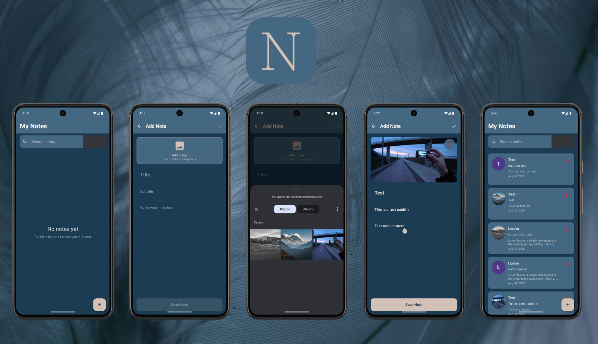
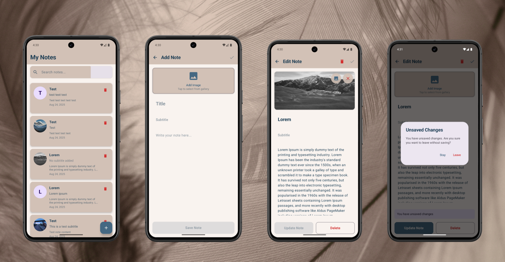

# QuickNote 📝

**QuickNote** is a modern Android note-taking application that combines simplicity with powerful features. Built with cutting-edge Android development technologies, it offers users an intuitive way to create, organize, and manage their thoughts with support for rich media content.

## 📸 Screenshots





## ✨ Features

* 📝 **Complete Note Management**: Create, edit, and delete notes with titles, subtitles, and rich content
* 🖼️ **Image Support**: Add images to your notes with gallery integration and permission handling
* 🔍 **Smart Search**: Quickly find notes by searching through titles and subtitles
* 🎭 **Avatar System**: Visual note identification with image thumbnails or title initials
* 📱 **Modern UI**: Clean, intuitive interface built with Jetpack Compose and Material Design 3
* 🌙 **Adaptive Theming**: Beautiful color schemes that adapt to your device settings
* 💾 **Local Storage**: Secure offline storage with Room database
* ⚡ **Real-time Updates**: Instant UI updates with reactive programming

## 🛠️ Tech Stack

* **Jetpack Compose** - Modern declarative UI toolkit
* **MVVM + Clean Architecture** - Structured development pattern with separation of concerns
* **Dagger Hilt** - Dependency injection framework
* **Room Database** - Local data persistence
* **Coroutines + Flow** - Asynchronous programming and reactive streams
* **Navigation Compose** - Type-safe navigation
* **Material Design 3** - Latest Material Design components

## 🏗️ Architecture

The app follows **Clean Architecture** principles with three main layers:

* **Data Layer**: Room database, repositories, and data sources
* **Domain Layer**: Use cases and business logic
* **UI Layer**: ViewModels, Compose screens, and UI components

## 📱 Screens

* 🏠 **Note List Screen** - Browse all notes with search functionality and avatar previews
* ➕ **Add Note Screen** - Create new notes with text and image content
* ✏️ **Edit Note Screen** - Modify existing notes with full CRUD operations
* 🖼️ **Image Picker** - Gallery integration with permission handling

## 🎨 Key Components

* **Note Entity** - Room database model with timestamp-based sorting
* **Image Management** - Complete image lifecycle with internal storage
* **Permission System** - Graceful handling of gallery permissions with user-friendly prompts
* **Search Engine** - Real-time search through note titles and subtitles
* **Avatar Generator** - Dynamic visual representations for notes

## 🔧 Getting Started

1. Clone the repository
   ```bash
   git clone https://github.com/altanbkoc/QuickNoteApp.git
   ```

2. Open in Android Studio

3. Sync project with Gradle files

4. Run the app

## 📦 Dependencies

**Core**: Jetpack Compose, Material 3, Activity Compose, Navigation Compose  
**Architecture**: Dagger Hilt, ViewModel, Lifecycle Components, Room Database  
**Media**: Gallery Access, Image File Management  
**Async**: Kotlin Coroutines, Flow  
**UI**: Material Icons Extended, Accompanist Permissions  

## 🔒 Permissions

The app requires the following permissions for full functionality:

* `READ_MEDIA_IMAGES` - Access gallery images (Android 13+)
* `READ_EXTERNAL_STORAGE` - Access gallery images (Android 12 and below)
* `READ_MEDIA_VISUAL_USER_SELECTED` - Enhanced user control over media access

## 🏃‍♂️ Performance

* **Lazy Loading** - Efficient list rendering with LazyColumn
* **Image Optimization** - Smart caching and memory management
* **Database Optimization** - Indexed queries and efficient relationships
* **State Management** - Optimized recomposition with stable state holders

## 🤝 Contributing

Contributions are welcome! Please feel free to submit a Pull Request. For major changes, please open an issue first to discuss what you would like to change.

1. Fork the Project
2. Create your Feature Branch (`git checkout -b feature/AmazingFeature`)
3. Commit your Changes (`git commit -m 'Add some AmazingFeature'`)
4. Push to the Branch (`git push origin feature/AmazingFeature`)
5. Open a Pull Request

## 📄 License

This project is licensed under the MIT License - see the [LICENSE](LICENSE) file for details.

## 👨‍💻 Developer

**Altan Koç**
* GitHub: [@altanbkoc](https://github.com/altanbkoc)

---

⭐ **If you found this project helpful, please give it a star!** ⭐

---

*Built with ❤️ using Kotlin and Jetpack Compose*
